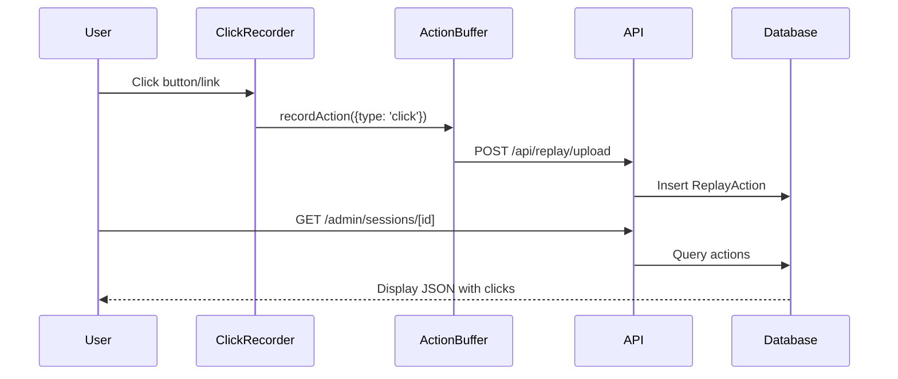

# Testing: Session Replay - Click Recording

**Feature**: Record user clicks (buttons, links) for session replay  
**Verification Time**: ~60 seconds  
**Status**: ✅ Complete

## Quick Start (30 seconds)

1. Set `NEXT_PUBLIC_REPLAY_ENABLED=true` in `.env.local`
2. Start dev server: `npm run dev`
3. Log in as any authenticated user
4. Click 2-3 buttons or links on any page
5. Wait 5 seconds
6. Visit `/admin/sessions` (as admin user)
7. Click on a session ID
8. ✅ **Verify**: See click actions (`t: "c"`) in the JSON log

## Prerequisites

- **Environment**: `NEXT_PUBLIC_REPLAY_ENABLED=true` in `.env.local`
- **Authentication**: Must be logged in
- **Admin Access**: Must have `ADMIN` role to view `/admin/sessions`
- **Route Recording**: Should already be working (see [route recording test](session-replay-route-recording.md))

## Test Steps

1. **Enable**: Add `NEXT_PUBLIC_REPLAY_ENABLED=true` to `.env.local`
2. **Start**: Run `npm run dev`
3. **Record**: Log in, navigate to any page, click buttons/links
4. **Wait**: 5 seconds for actions to upload
5. **Verify**: Visit `/admin/sessions/[id]` and see click actions in JSON

## Expected Results

Click actions appear as:
```json
{
  "t": "c",  // type: click
  "ts": 1234567890,
  "d": {
    "s": "[data-testid=\"like-button\"]",  // selector
    "tg": "/edit-profile"  // target: pathname (no domain) or element tag
  }
}
```

## Architecture Diagram



## Troubleshooting

**Clicks Not Recording**: Check element has stable selector (data-testid, role, href, or button text). Admin pages excluded.

**Selector Not Found**: Add `data-testid` to important clickable elements.

## Implementation Details

- **Component**: `src/components/replay/ClickRecorder.tsx`
- **Handler**: `src/lib/replay/recordClick.ts`
- **Encoding**: `{t: "c", d: {s: selector, tg: target}}`

---

**Documentation Path**: `docs/testing/session-replay-click-recording.md`
