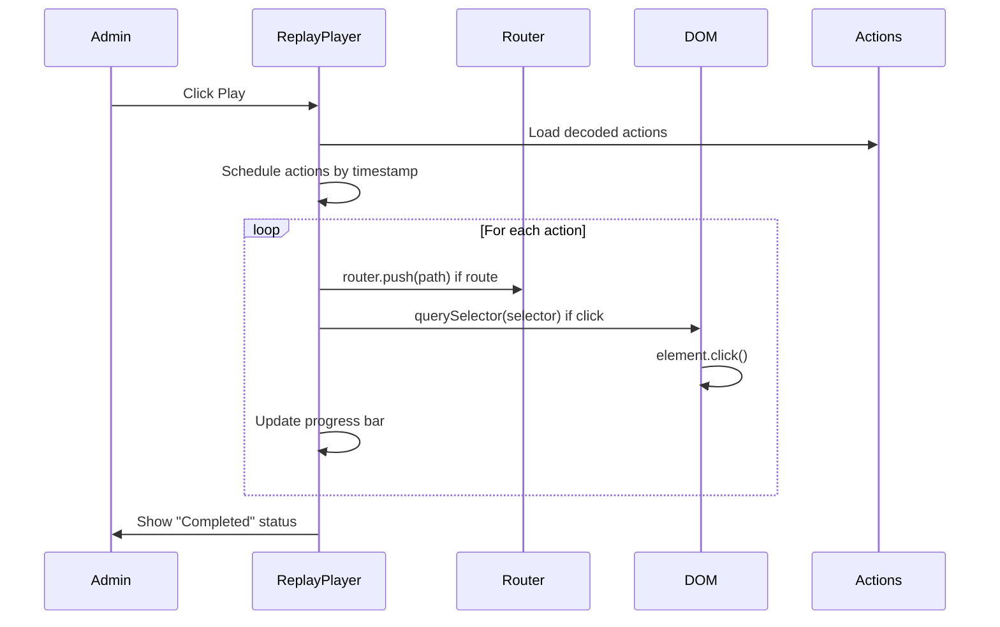

# Testing: Session Replay - Player

**Feature**: Replay recorded routes and clicks in admin interface  
**Verification Time**: ~60 seconds  
**Status**: ✅ Complete

## Quick Start (30 seconds)

1. Set `NEXT_PUBLIC_REPLAY_ENABLED=true` in `.env.local`
2. Start dev server: `npm run dev`
3. Log in as admin user
4. Visit `/admin/sessions` and click a session ID
5. Click **Play** button
6. ✅ **Verify**: Browser navigates through routes and clicks execute automatically

## Prerequisites

- **Environment**: `NEXT_PUBLIC_REPLAY_ENABLED=true` in `.env.local`
- **Admin Access**: Must have `ADMIN` role
- **Recorded Session**: Must have at least one session with route/click actions

## Test Steps

1. **Enable**: Add `NEXT_PUBLIC_REPLAY_ENABLED=true` to `.env.local`
2. **Start**: Run `npm run dev`
3. **Record**: Log in, navigate pages, click buttons/links (creates session)
4. **Replay**: Visit `/admin/sessions/[id]`, click **Play**
5. **Verify**: Watch browser automatically navigate and click

## Expected Results

- **Play Button**: Starts replay from beginning
- **Progress Bar**: Shows completion percentage
- **Route Changes**: Browser navigates to recorded paths
- **Clicks**: Elements are found and clicked automatically
- **Pause/Resume**: Can pause and resume replay
- **Stop**: Can stop and reset replay

## Architecture Diagram

## Troubleshooting

**Actions Not Executing**: Check selectors match current DOM. Elements may have changed.

**Routes Not Navigating**: Verify paths are valid. Check browser console for errors.

**Clicks Not Working**: Element selectors may not match. Check selector format in actions log.

## Implementation Details

- **Component**: `src/components/replay/ReplayPlayer.tsx`
- **Hook**: `src/lib/replay/useReplayActions.ts`
- **Encoding**: Actions decoded from database format

---

**Documentation Path**: `docs/testing/session-replay-player.md`
