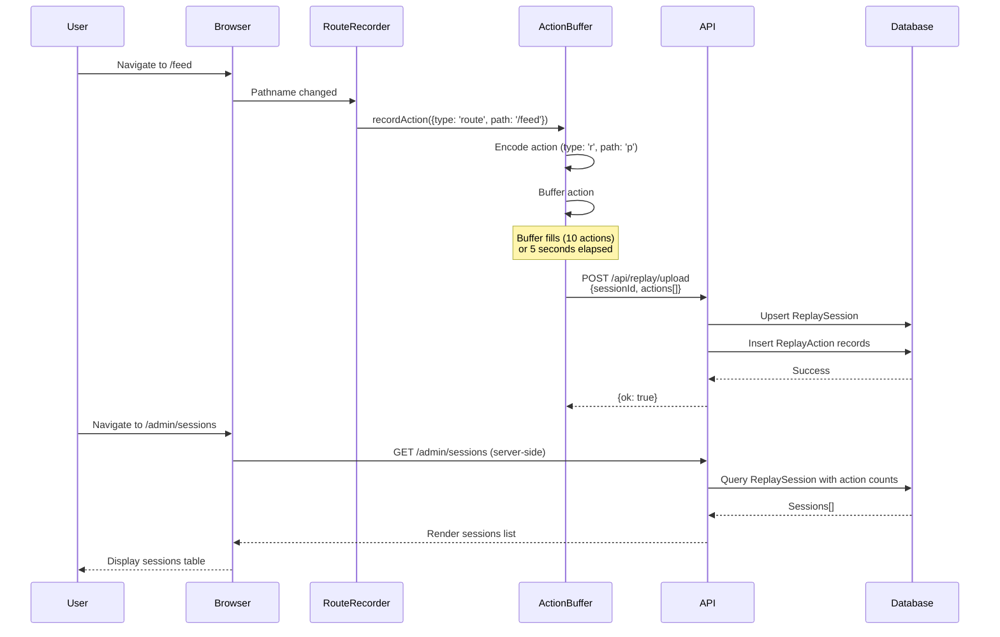

# Testing: Session Replay - Route Recording

**Feature**: Record user navigation (route changes) for session replay  
**Verification Time**: ~60 seconds  
**Status**: ✅ Complete

## Quick Start (30 seconds)

1. Set `NEXT_PUBLIC_REPLAY_ENABLED=true` in `.env.local`
2. Start dev server: `npm run dev`
3. Log in as any authenticated user
4. Navigate to 2-3 different pages (e.g., `/feed`, `/profile`)
5. Wait 5 seconds
6. Visit `/admin/sessions` (as admin user)
7. ✅ **Verify**: See your session listed with route change actions

## Prerequisites

- **Environment Variable**: `NEXT_PUBLIC_REPLAY_ENABLED=true` in `.env.local`
- **Authentication**: Must be logged in (session replay only records authenticated users)
- **Admin Access**: Must have `ADMIN` role in database to view `/admin/sessions`
- **Database**: Prisma migrations applied (`npx prisma migrate dev`)

## Test Steps

### 1. Enable Session Replay

Add to `.env.local`:
```bash
NEXT_PUBLIC_REPLAY_ENABLED=true
```

### 2. Start Development Server

```bash
npm run dev
```

### 3. Record a Session

1. **Log in** as any authenticated user (GitHub, Google, Facebook, or email)
2. **Navigate** between pages:
   - Go to `/feed`
   - Go to `/profile`
   - Go to any other page
3. **Wait 5 seconds** (actions buffer and upload automatically)

### 4. View Recorded Session

1. **Log in as admin user** (must have `ADMIN` role in database)
2. **Navigate** to `/admin/sessions`
3. **Verify** you see:
   - Session ID (truncated to 8 chars)
   - Action count (number of route changes recorded)
   - Started timestamp
   - Ended timestamp (or "—" if session still active)

### 5. View Session Details

1. **Click** on a session ID link
2. **Verify** you see:
   - Session ID
   - Number of actions recorded
   - JSON display of encoded actions (type `r` = route, `p` = path)

## Expected Results

### Admin Sessions List (`/admin/sessions`)

- **Table displays**:
  - Session ID (first 8 characters)
  - Action count (number of route changes)
  - Started time (formatted timestamp)
  - Ended time (formatted timestamp or "—")

### Session Details (`/admin/sessions/[id]`)

- **Displays**:
  - Full session ID
  - Total actions recorded
  - JSON array of actions:
    ```json
    [
      {
        "t": "r",        // type: route
        "ts": 1234567890, // timestamp
        "d": { "p": "/feed" } // data: path
      }
    ]
    ```

### Browser Console

- **No errors** should appear
- **No warnings** about replay (unless disabled)

### Database

- **`ReplaySession` table**: Contains session records with `userId`, `startedAt`, `endedAt`
- **`ReplayAction` table**: Contains encoded actions with `type`, `timestamp`, `data`

## Architecture Diagram



## Troubleshooting

### No Sessions Appearing

**Problem**: Sessions list shows "No sessions yet."

**Solutions**:
1. **Check environment variable**: Verify `NEXT_PUBLIC_REPLAY_ENABLED=true` in `.env.local`
2. **Restart dev server**: Environment variables require restart
3. **Check authentication**: Must be logged in (replay only records authenticated users)
4. **Check browser console**: Look for errors or warnings
5. **Wait longer**: Actions upload every 5 seconds or when buffer reaches 10 actions

### 403 Forbidden on `/admin/sessions`

**Problem**: Cannot access admin sessions page

**Solutions**:
1. **Check user role**: Must have `ADMIN` role in database
2. **Verify in Prisma Studio**: `npx prisma studio` → Check `User` table → `role` column
3. **Update role**: Set `role` to `'ADMIN'` for your user

### Actions Not Uploading

**Problem**: Navigated pages but no actions in database

**Solutions**:
1. **Check network tab**: Look for `POST /api/replay/upload` requests
2. **Check server logs**: Look for `replay_actions_uploaded` log entries
3. **Verify API endpoint**: Check `/api/replay/upload` returns `{ok: true}`
4. **Check database**: Verify `ReplayAction` table has records

### Encoding Issues

**Problem**: Actions show incorrect data or types

**Solutions**:
1. **Check encoding**: Verify `src/lib/replay/encoding.ts` has correct mappings
2. **Check action format**: Actions should have `{t: string, ts: number, d: object}`
3. **Verify database**: Check `ReplayAction.type` and `ReplayAction.data` columns

## Implementation Details

- **Recording Component**: `src/components/replay/RouteRecorder.tsx`
- **Action Buffer**: `src/lib/replay/actionBuffer.ts`
- **Encoding**: `src/lib/replay/encoding.ts`
- **Upload API**: `src/app/api/replay/upload/route.ts`
- **Admin Pages**: `src/app/admin/sessions/page.tsx`

## Next Steps

- [ ] Click recording
- [ ] Input field recording
- [ ] Basic replay UI

---

**Documentation Path**: `docs/testing/session-replay-route-recording.md`
