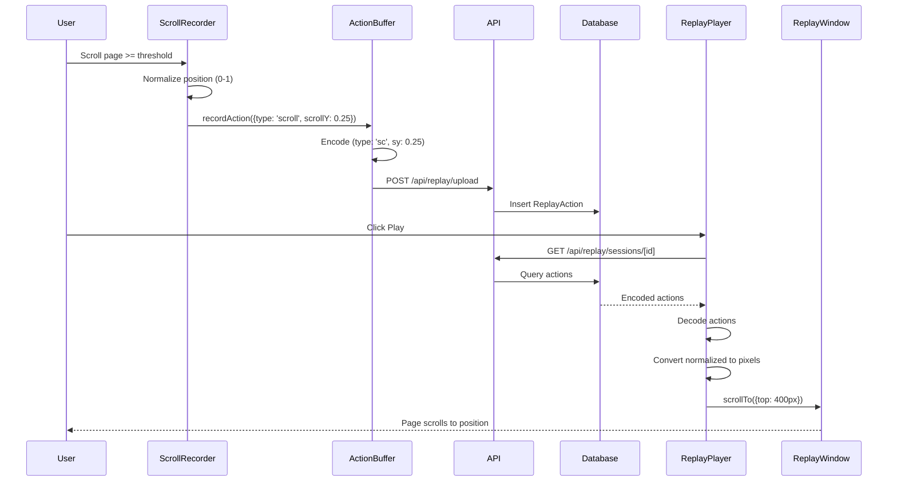

# Testing: Session Replay - Scroll Recording & Replay

**Feature**: Record and replay scroll positions for session replay  
**Verification Time**: ~60 seconds  
**Status**: ✅ Complete

## Quick Start (30 seconds)

1. Set `NEXT_PUBLIC_REPLAY_ENABLED=true` and `NEXT_PUBLIC_REPLAY_SCROLL_THRESHOLD_NORMALIZED=0.1` in `.env.local`
2. Start dev server: `npm run dev`
3. Log in as any authenticated user
4. Navigate to a page with scrollable content (e.g., `/feed`)
5. Scroll down significantly (>= 10% of page)
6. Wait 5 seconds
7. Visit `/admin/sessions` (as admin user)
8. Click on a session ID
9. Click **Play** button
10. ✅ **Verify**: Replay window scrolls to match recorded positions

## Prerequisites

- **Environment Variables**:
  - `NEXT_PUBLIC_REPLAY_ENABLED=true` in `.env.local`
  - `NEXT_PUBLIC_REPLAY_SCROLL_THRESHOLD_NORMALIZED=0.1` (optional, 10% threshold)
- **Authentication**: Must be logged in
- **Admin Access**: Must have `ADMIN` role to view `/admin/sessions`
- **Scrollable Content**: Page must have content that can be scrolled

## Test Steps

### 1. Enable Scroll Recording

Add to `.env.local`:
```bash
NEXT_PUBLIC_REPLAY_ENABLED=true
NEXT_PUBLIC_REPLAY_SCROLL_THRESHOLD_NORMALIZED=0.1
```

**Note**: If `NEXT_PUBLIC_REPLAY_SCROLL_THRESHOLD_NORMALIZED` is not set, scroll recording is completely disabled (zero overhead).

### 2. Record Scroll Actions

1. **Log in** as any authenticated user
2. **Navigate** to a page with scrollable content (e.g., `/feed`)
3. **Scroll down** significantly (>= threshold percentage of page height)
   - With threshold `0.1` (10%), scroll at least 10% of the page
   - Example: If page is 2000px tall, scroll at least 200px
4. **Scroll up** significantly (>= threshold)
5. **Wait 5 seconds** for actions to upload

### 3. Verify Scroll Actions Recorded

1. **Log in as admin user** (must have `ADMIN` role)
2. **Navigate** to `/admin/sessions`
3. **Click** on your session ID
4. **Verify** you see scroll actions in the JSON log:
   ```json
   {
     "type": "scroll",
     "timestamp": 1234567890,
     "data": {
       "scrollY": 0.25,  // Normalized position (0-1)
       "scrollX": 0
     }
   }
   ```

### 4. Replay Scroll Actions

1. **Click** the **Play** button
2. **Watch** the replay window (opens in new tab)
3. **Verify** the window scrolls to match recorded positions
4. **Verify** scroll positions are accurate even if replay window size differs from recording

## Expected Results

### Scroll Actions Format

Scroll actions are encoded with normalized positions (0-1 ratio):
```json
{
  "t": "sc",  // type: scroll
  "ts": 1234567890,
  "d": {
    "sy": 0.25,  // scrollY: 25% down the page (normalized)
    "sx": 0      // scrollX: 0% from left (normalized)
  }
}
```

### Recording Behavior

- **Threshold-Based**: Only records when scroll changes by >= threshold (default 10% if configured)
- **Normalized Positions**: Positions stored as 0-1 ratio, not pixels
- **Size-Independent**: Works correctly across different screen sizes
- **Minimal Events**: Typically 2-5 scroll events per page, not hundreds
- **No Initial Position**: First scroll position is not recorded (baseline)

### Replay Behavior

- **Size-Independent**: Replay works correctly even if replay window has different dimensions
- **Normalized Conversion**: Normalized positions (0-1) converted back to pixels based on replay window size
- **Chronological Order**: Scroll actions replay in order with routes and clicks
- **Instant Scroll**: Scroll happens instantly (`behavior: 'auto'`) to match original timing

### Example: Size Independence

**Recording**:
- Window height: 1000px
- Document height: 2000px
- Scroll position: 500px
- Normalized: 500 / (2000 - 1000) = 0.5

**Replay**:
- Window height: 800px (different size)
- Document height: 1600px
- Normalized: 0.5
- Actual scroll: 0.5 * (1600 - 800) = 400px
- **Result**: Same relative position (50% down)

## Architecture Diagram



## Troubleshooting

### Scroll Actions Not Recording

**Problem**: Scrolled page but no scroll actions in session

**Solutions**:
1. **Check environment variable**: Verify `NEXT_PUBLIC_REPLAY_SCROLL_THRESHOLD_NORMALIZED` is set
2. **Check threshold**: Scroll must change by >= threshold percentage (e.g., 10% with `0.1`)
3. **Check scrollable content**: Page must have content taller/wider than viewport
4. **Wait longer**: Actions upload every 5 seconds or when buffer reaches 10 actions
5. **Check console logs**: Look for `[recordScroll]` messages

### Scroll Position Incorrect During Replay

**Problem**: Replay window scrolls to wrong position

**Solutions**:
1. **Normalization**: Scroll positions are normalized (0-1), conversion happens during replay
2. **Window size**: Replay window size may differ, but relative position should be correct
3. **Content changes**: If page content changed, scroll positions may not match
4. **Check console**: Look for errors in replay window console

### Too Many Scroll Events

**Problem**: Session has hundreds of scroll events

**Solutions**:
1. **Increase threshold**: Set `NEXT_PUBLIC_REPLAY_SCROLL_THRESHOLD_NORMALIZED=0.2` (20% instead of 10%)
2. **Debouncing**: Scroll events are debounced (200ms), but threshold controls recording frequency

### Scroll Recording Disabled

**Problem**: Want to disable scroll recording

**Solution**:
- **Remove or comment out** `NEXT_PUBLIC_REPLAY_SCROLL_THRESHOLD_NORMALIZED` from `.env.local`
- Scroll recording will be completely disabled (zero overhead, no event listeners)

## Implementation Details

- **Component**: `src/components/replay/ScrollRecorder.tsx`
- **Handler**: `src/lib/replay/recordScroll.ts`
- **Replay**: `src/components/replay/ReplayPlayer.tsx` (executeAction with scroll handling)
- **Encoding**: `{t: "sc", d: {sy: normalizedY, sx: normalizedX}}`
- **Threshold**: Normalized ratio (0-1), minimum 0.01 (1%), clamped automatically

## Configuration Options

### Threshold Values

- `0.01` (1%): Most granular, records small scrolls
- `0.1` (10%): Balanced (recommended)
- `0.2` (20%): Less granular, fewer events
- `0.5` (50%): Very coarse, only major scrolls

### Disabling Scroll Recording

- **Omit** `NEXT_PUBLIC_REPLAY_SCROLL_THRESHOLD_NORMALIZED` from `.env.local`
- No event listeners added
- No function calls executed
- Zero performance overhead

---

**Documentation Path**: `docs/testing/session-replay-scroll-recording.md`
